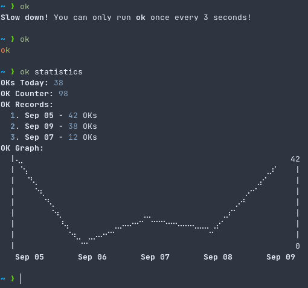

# ok


## Installation
### Releases
Pre-compiled binaries are available [here](https://github.com/ErrorNoInternet/ok/releases)

### Compiling
- Requirements
  - Rust (cargo)

```sh
git clone https://github.com/ErrorNoInternet/ok
cd ok

# compile in release mode
cargo build --release
```
The compiled executable can be found at `./target/release/ok`

<sub>Leaderboards have been temporarily removed due to API abuse (might be added back later with extra security)</sub>\
<sub>If you would like to modify or use this repository (including its code) in your own project, please be sure to credit!</sub>

